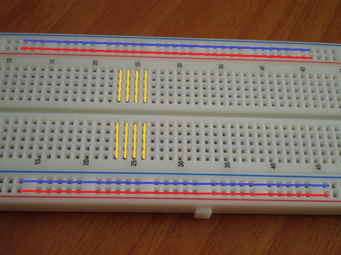
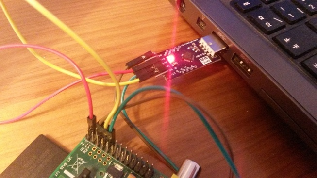

# HACK&BEER --> RPI
Repository for Hack&amp;Beers RaspberryPi recipes


### RPI GPIO Recipes
* [Led](recipe/led/README.md)
* [Led RGB](recipe/rgb_led/README.md)
* [Buzzer](recipe/buzzer/README.md)
* [Sensor Temperature](recipe/sensor_temperature/README.md)
* [Sensor Light](recipe/sensor_light/README.md)

### Protoboard



### UART Laptop --> RPI

Connect Laptop and RPI.



| RPI   |      Module      |
|----------|:-------------:|
| VCC | + 5V |
| Tx | GPIO 14 (UART TXD) |
| Rx | GPIO 15 (UART RXD) |
| Gnd | GND |


```bash
sudo apt-ger install ckermit # Install ckermit program (for serial port)
sudo reboot
sudo kermit -l /dev/ttyAMA0 # (or /dev/ttyAMA1)

# Configuration
C-Kermit> set speed 115200
C-Kermit> set parity none
C-Kermit> set flow-control none
C-Kermit> set carrier-watch off
C-Kermit> connect

Connecting to /dev/ttyAMA0, speed 115200
 Escape character: Ctrl-\ (ASCII 28, FS): enabled
Type the escape character followed by C to get back,
or followed by ? to see other options.
----------------------------------------------------
# Click enter

Raspbian GNU/Linux 7 raspberrypi ttyAMA0

raspberrypi login: pi
Password:

pi@raspberrypi:~$ 

```


