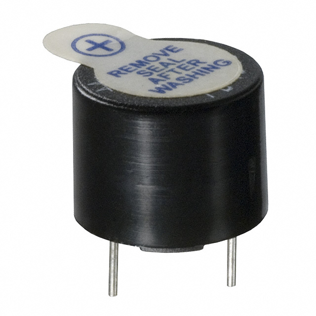
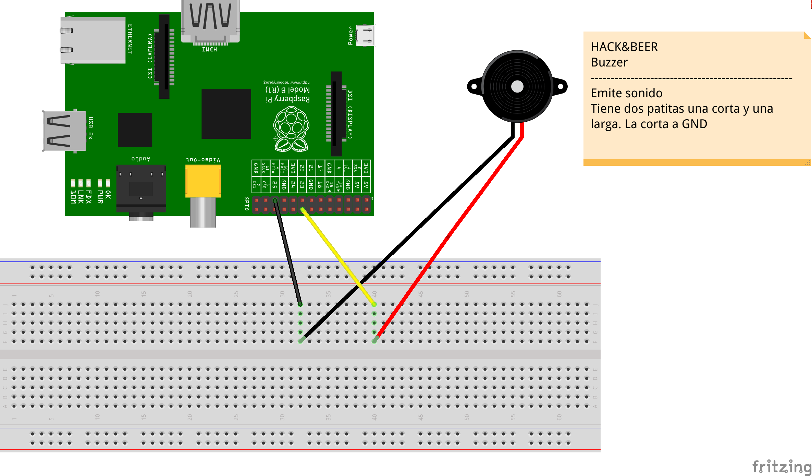

## Buzzer recipe



Circuit




```python
#!/usr/bin/env python

import RPi.GPIO as GPIO
import time


BUZZER = 17


if __name__  == "__main__":

    print "Init buzzer program"

    GPIO.setmode(GPIO.BCM)
    GPIO.setup(BUZZER, GPIO.OUT)

    while True:  
        GPIO.output(BUZZER, True)
        time.sleep(2)
        GPIO.output(BUZZER, False)
        time.sleep(2)

    GPIO.cleanup()
```
