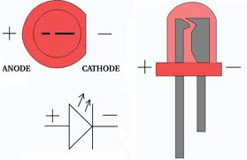
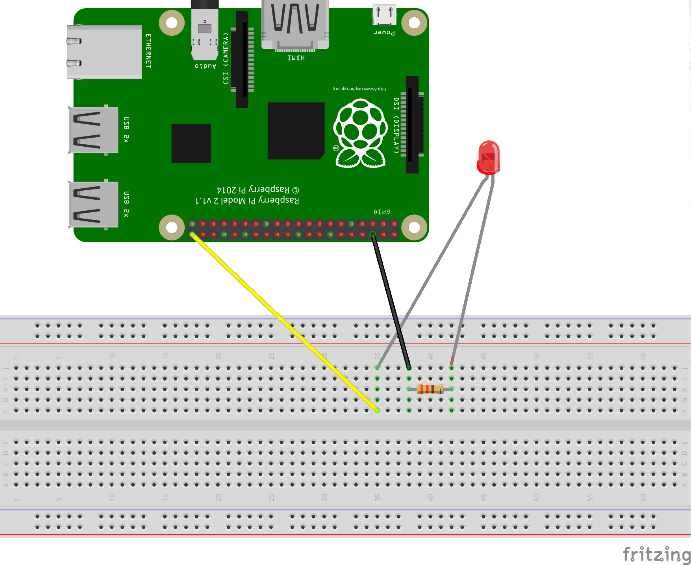

## Led basic recipe



Circuit




```python
#!/usr/bin/env python

import RPi.GPIO as GPIO
import time

LED = 7


def setup(led):

    GPIO.cleanup()
    GPIO.setmode(GPIO.BCM)
    GPIO.setup(led, GPIO.OUT)

def blink(led):

    GPIO.output(led, GPIO.HIGH)
    time.sleep(2)
    GPIO.output(led, GPIO.LOW)
    time.sleep(2)


if __name__  == "__main__":

    setup(LED)
    
    try:
        while True:
            print "Blink led"
            blink(LED)
    except KeyboardInterrupt:
        print "Exception"
        GPIO.cleanup()
```


