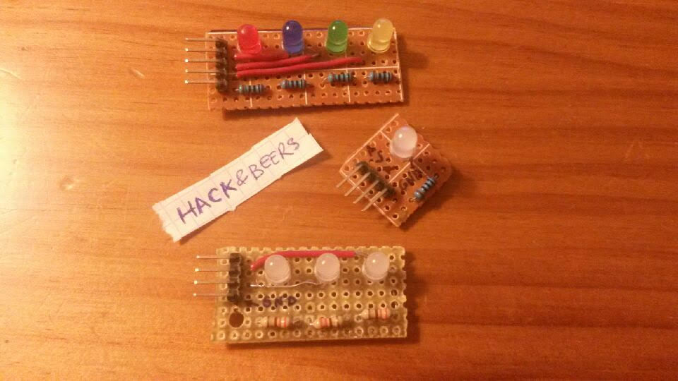

```python

#!/usr/bin/env python

import RPi.GPIO as GPIO
import time

LED1 = 17
LED2 = 27 
LED3 = 22
LED4 = 23


def setup(led1, led2, led3, led4):

    GPIO.cleanup()
    GPIO.setmode(GPIO.BCM)
    GPIO.setup(led1, GPIO.OUT)
    GPIO.setup(led2, GPIO.OUT)
    GPIO.setup(led3, GPIO.OUT)
    GPIO.setup(led4, GPIO.OUT)

def blink_down(led):
    GPIO.output(led, GPIO.LOW)

def blink_up(led, speed):
    GPIO.output(led, GPIO.HIGH)
    time.sleep(speed)

def scroll(led1, led2, led3, led4, time):

    blink_up(led1, time)
    blink_down(led1)
    blink_up(led2, time)
    blink_down(led2)
    blink_up(led3, time)
    blink_down(led3)
    blink_up(led4, time)
    blink_down(led4)

if __name__  == "__main__":

    setup(LED1, LED2, LED3, LED4)
    
    try:
        while True:
            scroll(LED1, LED2, LED3, LED4, 0.2)

    except KeyboardInterrupt:
        print "Exception"
        GPIO.cleanup()
            


```
