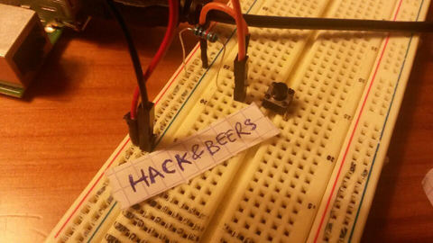
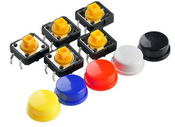
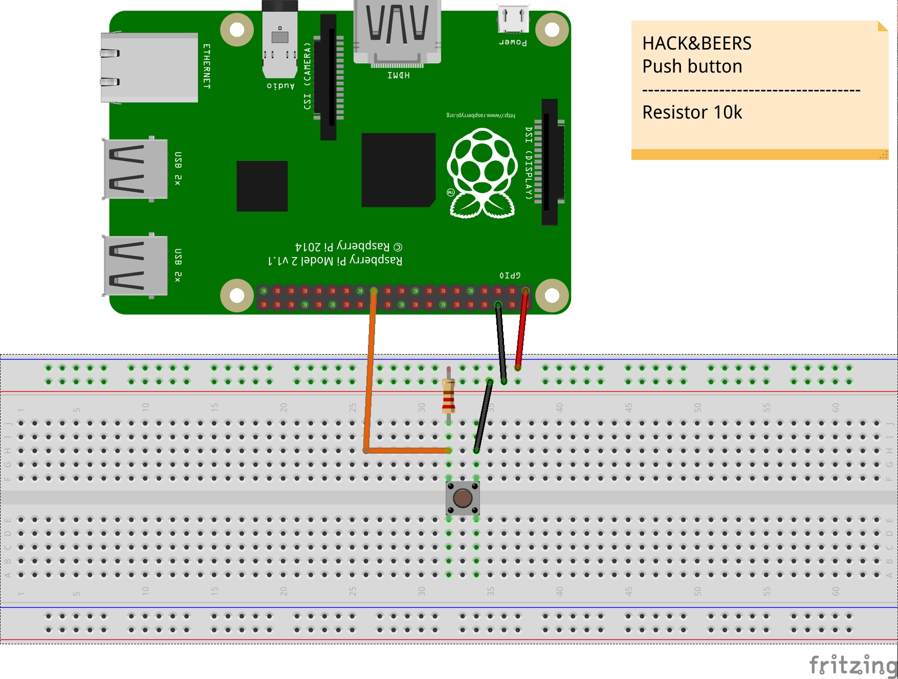

## Push button recipe




Push button




Circuit




```python
#!/usr/bin/python


import RPi.GPIO as GPIO
import time as time

BUTTON_PIN = 11


GPIO.setmode(GPIO.BCM)
GPIO.setup(BUTTON_PIN,GPIO.IN)


while True:

    time.sleep(0.2)

    if GPIO.input(BUTTON_PIN) == False:
        print "Push button ok"

```
