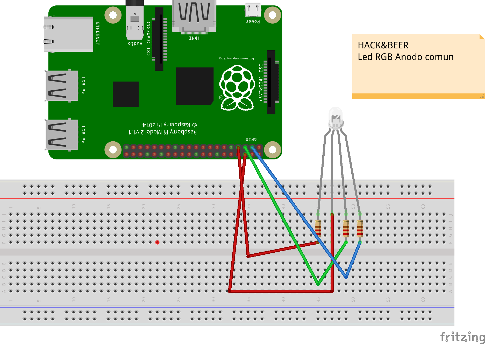

## RGB led recipe




```python
#!/usr/bin/python

import RPi.GPIO as GPIO
import time

SLEEP_TIME = 1

GPIO.cleanup()
GPIO.setmode(GPIO.BOARD)

# Red
GPIO.setup(11,GPIO.OUT)
GPIO.output(11,1)

# Green
GPIO.setup(13,GPIO.OUT)
GPIO.output(13,1)

# Blue
GPIO.setup(15,GPIO.OUT)
GPIO.output(15,1)

def setColor(value1, value2, value3,sleep_time):
    GPIO.output(11, value1)
    GPIO.output(13, value2)
    GPIO.output(15, value3)
    time.sleep(sleep_time)


if __name__ == "__main__":

    try:
        while(True):
            setColor(1, 1, 1, SLEEP_TIME) 
            setColor(1, 0, 1, SLEEP_TIME) 
            setColor(0, 0, 1, SLEEP_TIME)
            setColor(1, 0, 0, SLEEP_TIME)
            setColor(0, 1, 0, SLEEP_TIME)
            setColor(1, 1, 0, SLEEP_TIME)
            setColor(0, 0, 0, SLEEP_TIME)
            
        
    except KeyboardInterrupt:
        GPIO.cleanup()


```
