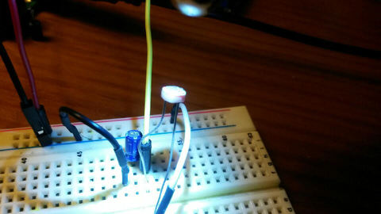
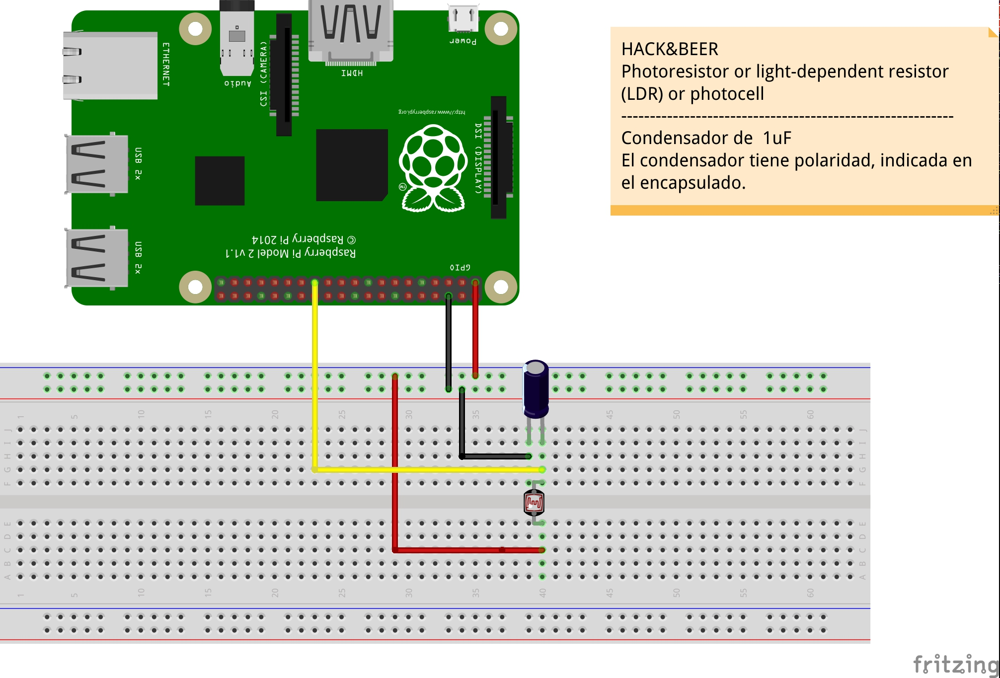

## Sensor light recipe




Circuit



```python
#!/usr/bin/env python

import RPi.GPIO as GPIO
import time

GPIO.setmode(GPIO.BCM)

def timer(pin):

    reading = 0

    GPIO.setup(pin, GPIO.OUT)
    GPIO.output(pin, GPIO.LOW) # discharge the capacitor
    time.sleep(0.1) # wait for 100ms the capacitor discharges
    GPIO.setup(pin, GPIO.IN)

    # until the capacitor is charged 
    while (GPIO.input(pin) == GPIO.LOW): 
        reading += 1

    return reading


if __name__ == "__main__":

    print "Init ldr program"
 
    while True:
        time.sleep(0.5)
        result = timer(7)
        print " " + str(result)
 

```
