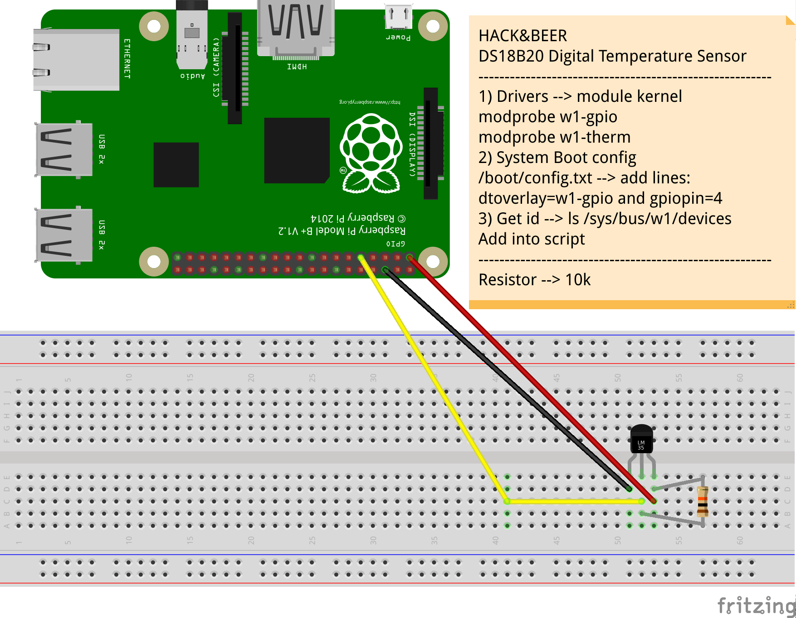

## Sensor temperature recipe 




```python
#!/usr/bin/python

# --------------------------------
# 1) Probe if driver is in kernel
# modprobe w1-gpio
# modprobe w1-ther
#
# 2) Edit system config
# edit /boot/config.txt
#
# add lines:
#     dtoverlay=w1-gpio
#     gpiopin=4
# 3) Id for devices
# ls /sys/bus/w1/devices --> 
# set the id in the script
#
# ----------------------

import time

def gettemp(id):

    try:
        mytep = ''
        filename = 'w1_slave'
        f = open('/sys/bus/w1/devices/' + id + '/' + filename, 'r')
        line = f.readline()
        crc = line.rsplit(' ',1)
        status = crc[1].replace('\n','')
        
        if status == 'YES':
            line = f.readline()
            mytemp = line.rsplit('t=',1)
        else:
            mytemp = 99999

        f.close()

        return int(mytemp[1])

    except Exception as ex:
        print str(ex)
        return 99999

if __name__ == '__main__':

    id = '28-000006bf911b' # poner el id generado
    while True:
        print "Temp : " + '{:.3f}'.format(gettemp(id)/float(1000))
        time.sleep(2)
```


